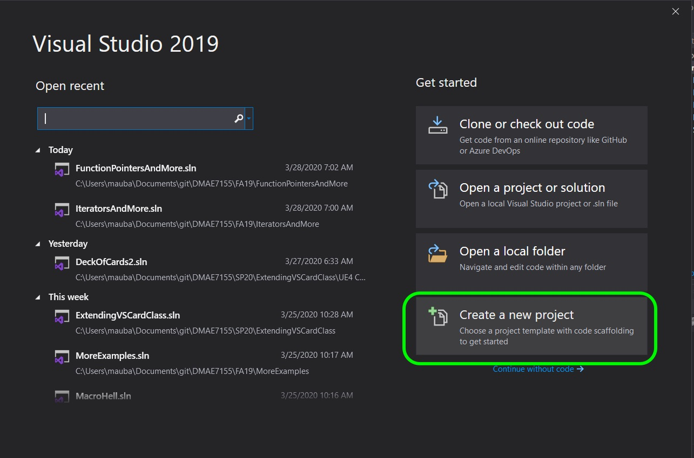
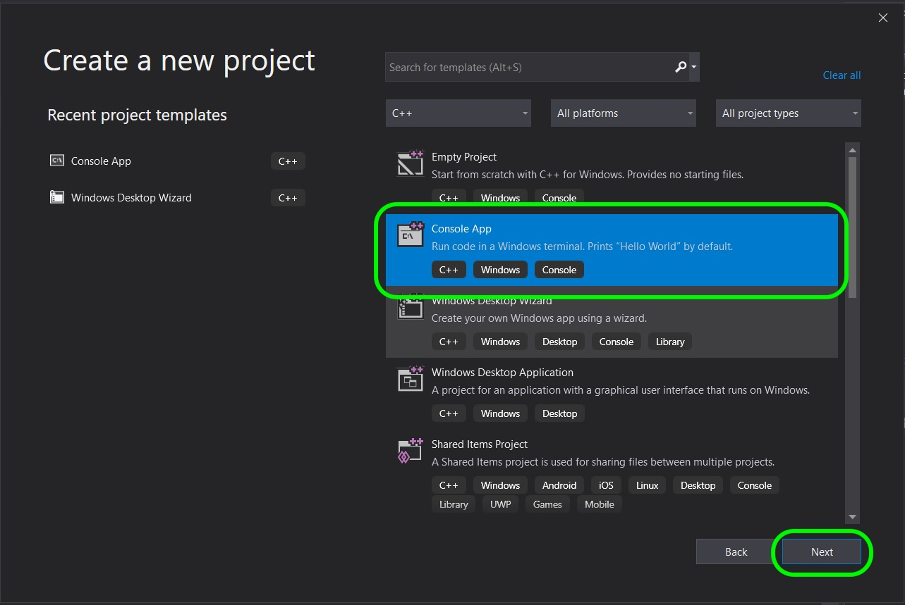
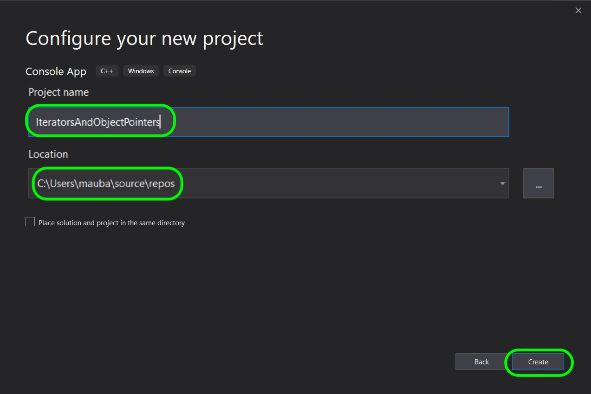
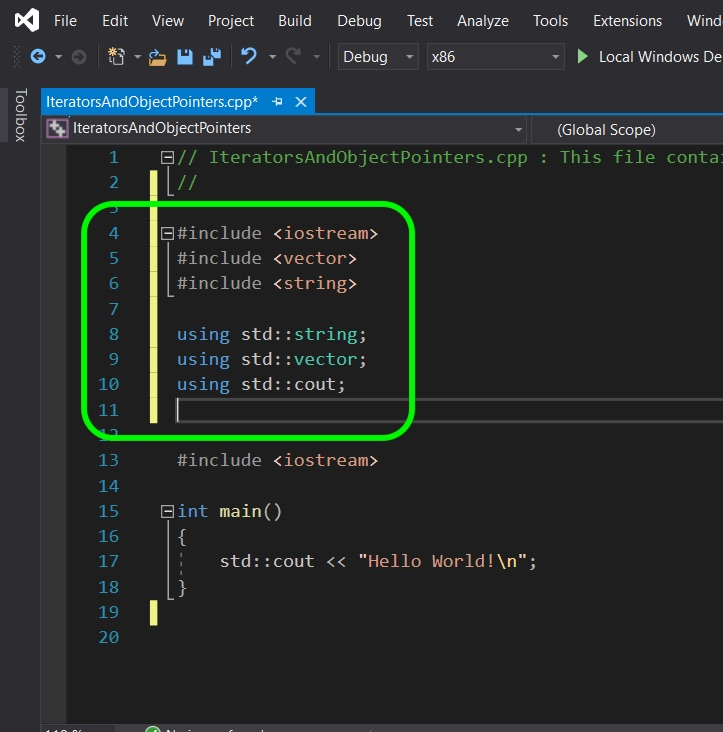
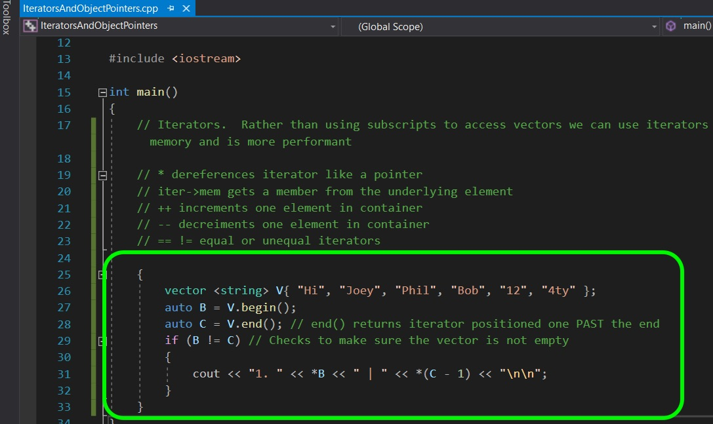
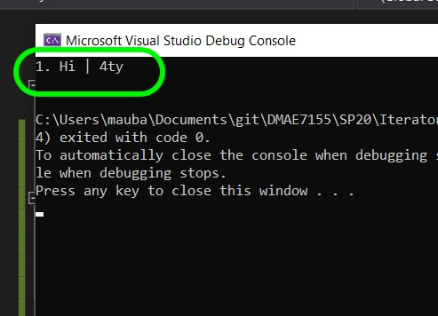
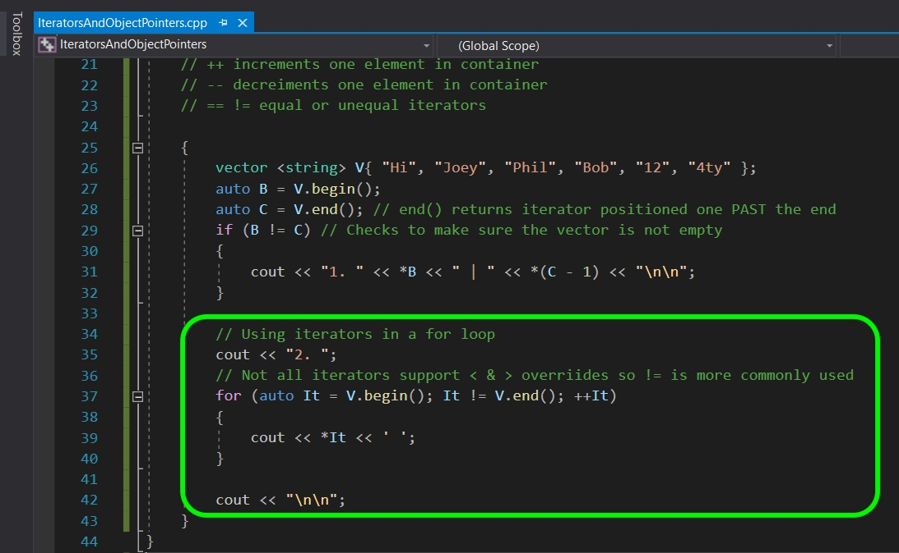
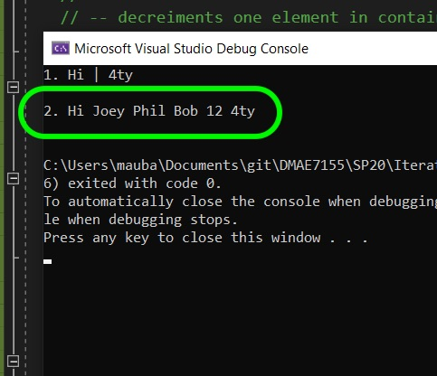
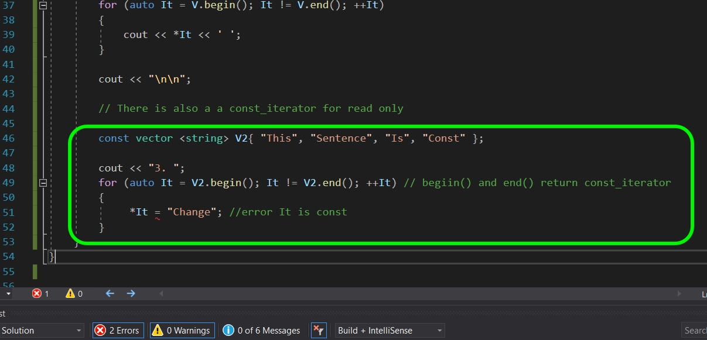
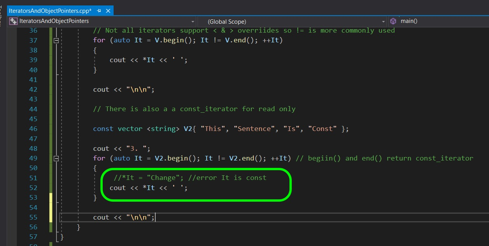

# Iterators & Object Pointers 1
_____ 

* Part I - Iterators
1. [Template Iterators](CPP-Cards-II-1.html#orstemplate-iterat)

_____ 

## Template Iterators
Most containers are created with iterators to access members of that data structure safely. It is an object (sometimes a pointer) that has the ability to iterate through the elements in range.  Each coorntainer has different iterator options that can include forward, backward, begin, end and random access to name a few. These iterators normally have a mutable (non-const) version and a const version that doesn't allow you to change the item in the container.  Lets take a look.

_____ 



{:start="{{ num }}"}
{{ num }}. Open up **Visual Studio** and start a new project.

  

_____ 



{:start="{{ num }}"}
{{ num }}. Select a **Console App** then press the **Next** button.

  



{:start="{{ num }}"}
{{ num }}. Call the new Project `IteratorsAndObjectPointers` and select a convenient location.  Press the **Create** button to build the template for this project.

  



{:start="{{ num }}"}
{{ num }}. Add a **Vector** and **String** header and to make the code more legible allow us to directly access **string**, **vector** and **cout** without having to prepend `std::`.

  



{:start="{{ num }}"}
{{ num }}. Rather thaorn using subscripts (Vector[0]) which dereference the item, we can get an iterator which allows us to access this item through its interface like a pointer.  This uses less memory and is more performant.  A few things: `*` dereferences iterator like a pointer to see the element `++` incremenst one element in the container `--` decrements one element in the container `!=` or `==` checks for equality of iterators.   Now lets create a vector and use the **Vector's** function of **begin()** and **end()** to get the begining and the end of a vector  Please note that end is one element **PAST** the last element.  So this returns the end of the memory location and is out of bounds of the container (one past the end). So lets print out the first element and the last element (end() -1).

  



{:start="{{ num }}"}
{{ num }}. Compile and run the project to see the first and last item in the container.

  



{:start="{{ num }}"}
{{ num }}. We can use the iterators to safely go through a **for loop** without going out of bounds on the vector.  We can use **auto** so we don't have to worry about the iterator type this container is using or its protection level.  The `begin()` and `end()` give us access to the first and last item in the container.  Please note that `end()` gives us one past the final item (we are already at the end) so to access the final item in the container you need to look at `end() -1`.

  



{:start="{{ num }}"}
{{ num }}. Compile, fixe erros and run.  Notcie that it loops through all of the strings.

  



{:start="{{ num }}"}
{{ num }}. Try the same things again, but this time make it a **const vector**.  The vector container's iterator supports constant structure.  **Auto** will copy the low-level protection of the vector and will be const. Lets prove it by making a const vector, looping through it with **auto** and trying to change one of its members.

  



{:start="{{ num }}"}
{{ num }}. Intead we will output the iterator and dereference it with `*It`.

  



{:start="{{ num }}"}
{{ num }}. 

  



{:start="{{ num }}"}
{{ num }}. 

  



{:start="{{ num }}"}
{{ num }}. 

  



{:start="{{ num }}"}
{{ num }}. 

  



{:start="{{ num }}"}
{{ num }}. 

  



{:start="{{ num }}"}
{{ num }}. 

  



{:start="{{ num }}"}
{{ num }}. 

  



{:start="{{ num }}"}
{{ num }}. 

  



{:start="{{ num }}"}
{{ num }}. 

  



{:start="{{ num }}"}
{{ num }}. 

  



{:start="{{ num }}"}
{{ num }}. 

  



{:start="{{ num }}"}
{{ num }}. 

  



{:start="{{ num }}"}
{{ num }}. 

  



{:start="{{ num }}"}
{{ num }}. 

  



{:start="{{ num }}"}
{{ num }}. 

  



{:start="{{ num }}"}
{{ num }}. 

  



{:start="{{ num }}"}
{{ num }}. 

  



{:start="{{ num }}"}
{{ num }}. 

  



{:start="{{ num }}"}
{{ num }}. 

  



{:start="{{ num }}"}
{{ num }}. 

  



{:start="{{ num }}"}
{{ num }}. 

  



{:start="{{ num }}"}
{{ num }}. 

  



{:start="{{ num }}"}
{{ num }}. 

  



{:start="{{ num }}"}
{{ num }}. 

  

_____ 

  

[Home](../index.html)&nbsp;&nbsp;&nbsp; [Continue ->](CPP-Cards-II-2.html)
   
   
   

